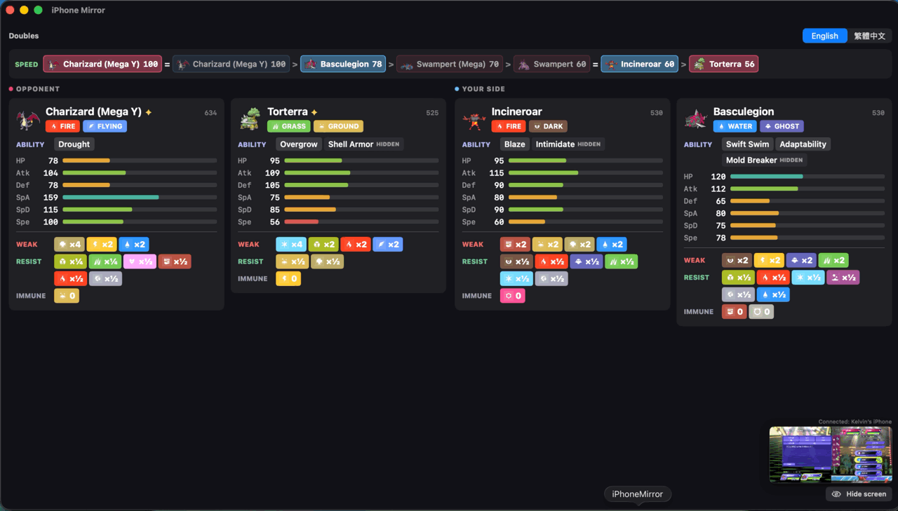
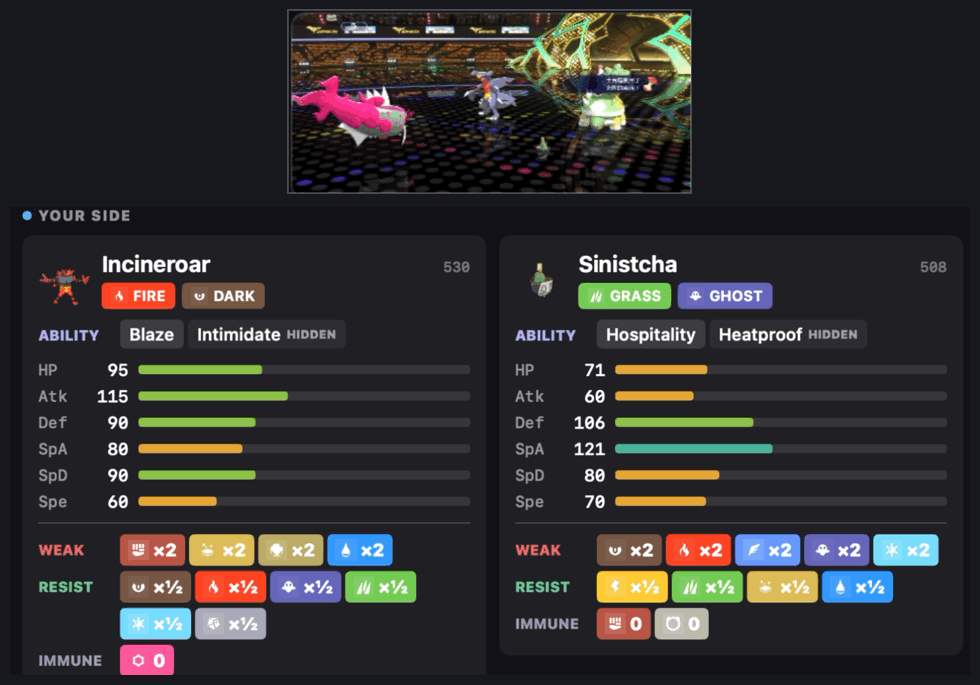
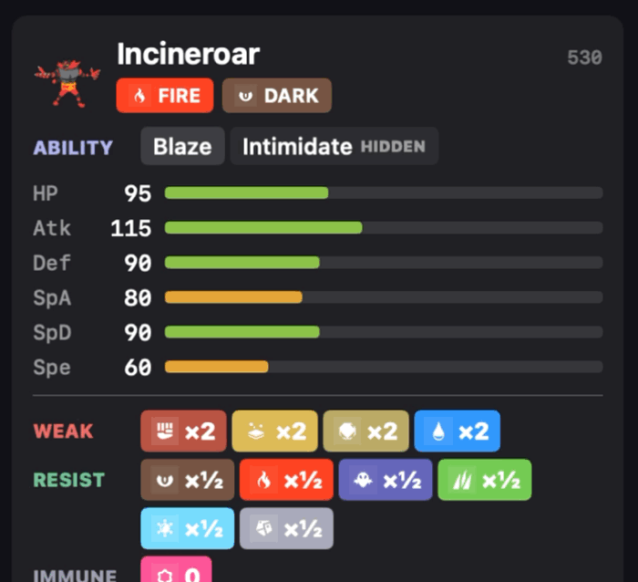
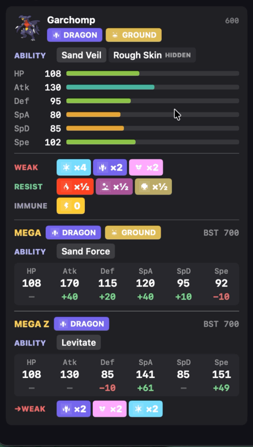
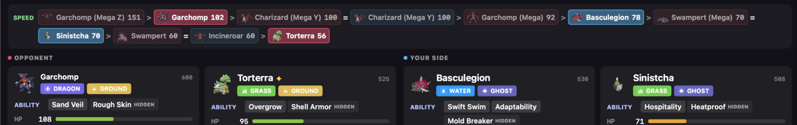

# Pokémon Champions Analyzer

A macOS app that mirrors your iPhone over USB while you play **Pokémon Champions**,
recognises every Pokémon on the field, and shows its stats, abilities, type matchups,
possible Mega Evolutions and speed order in real time.

It only looks at the screen. Nothing is installed on the iPhone and the game is
not modified.



## Features

### Automatic identification

Each Pokémon is recognised from its name plate as it comes onto the field, in
singles and doubles, including shiny Pokémon, Mega forms and regional forms
(786 reference sprites). When a Pokémon switches in, its card and the speed list
update.



### Stat cards and type matchups

Each card shows the Pokémon's typing, abilities (hidden ability marked), base
stats and total, plus its weaknesses (×4, ×2), resistances (×½, ×¼) and
immunities. Doubles uses four columns, one per slot, in the game's left-to-right
order.

### Ability descriptions

Hover over an ability to read what it does.



### Mega Evolution preview

A card lists every Mega the Pokémon could turn into, including
Champions-exclusive forms such as Mega Z, with each Mega's typing, ability and
stat changes. When the typing changes, the new weaknesses are shown too.



### Speed list

Every Pokémon seen this battle, plus the Megas each could turn into, sorted
fastest first. Ties are joined with `=`, and the Pokémon currently on the field
are highlighted. Once a Pokémon has Mega Evolved, only that Mega is listed.



### English and Traditional Chinese

Switch the whole panel between English and 繁體中文 at any time.


### Built for use during play

- Cards stay up through move animations, and the panel clears when the first
  Pokémon of the next battle is identified.
- The mirror floats small in the corner, with a button to hide it.

## Requirements

- macOS 13 or later, on Apple Silicon or Intel. The app is built for both, but
  so far it has only been tested on macOS 26.6 with Apple Silicon.
- An iPhone with Pokémon Champions, a USB cable, and the iPhone set to trust
  this Mac.

## Download

1. Download `PokemonChampionsAnalyzer-<version>.zip` from the
   [latest release](https://github.com/sheeenie/pokemon-champions-anyalzer/releases/latest),
   then double-click it to unzip.
2. Move `Pokémon Champions Analyzer.app` to your Applications folder.
3. Open it. The first time, macOS blocks it because the app isn't signed with an
   Apple Developer ID. Click **Done**, not **Move to Trash**.
4. Open **System Settings → Privacy & Security**, scroll down to the message
   about Pokémon Champions Analyzer, click **Open Anyway**, then confirm. You
   only need to do this once.
5. When asked, allow camera access: macOS treats the iPhone's screen as a camera.

Nothing else needs installing: the sprites and Pokédex data are inside the app.

If macOS says the app "is damaged", or you'd rather skip steps 3 and 4, run this
in Terminal once, then open the app:

```bash
xattr -dr com.apple.quarantine "/Applications/Pokémon Champions Analyzer.app"
```

## Build from source

Needs Xcode Command Line Tools (`xcode-select --install`) and Python 3.

```bash
git clone https://github.com/sheeenie/pokemon-champions-anyalzer.git
cd pokemon-champions-anyalzer
python3 tools/fetch_pokedex.py
./build.sh
open "Pokémon Champions Analyzer.app"
```

`tools/fetch_pokedex.py` downloads the reference sprites and Pokédex data. The
first run takes several minutes; after that, results are cached in
`tools/.cache`. The Pokémon sprites aren't included in this repository, so run
this script before building, or the app can't identify anything.

`build.sh` packs the sprites, type icons and Pokédex data into the app's
executable and builds for both Apple Silicon and Intel, so the built
`Pokémon Champions Analyzer.app` is self-contained and can be copied to another Mac.
`tools/make_release.sh <version>` does the same and zips it in `dist/` for a
GitHub Release.

**Always start the app with `open`.** macOS only grants screen-capture permission
to the app bundle. Running the binary directly from a terminal gives a black
mirror. On first launch, allow the camera permission prompt: macOS treats the
iPhone's screen as a camera.

## Usage

1. Connect the iPhone, unlock it, and open Pokémon Champions.
2. Start a battle. Cards appear as each Pokémon's name plate is recognised,
   usually within about a second.
3. Use the switch at the top right to change language, and hover over an
   ability to read its description.
4. **Hide screen** / **Show screen** in the bottom-right corner toggles the
   mirror. Identification keeps running while it is hidden.
5. While connected, the iPhone sends its sound to the Mac instead of playing
   it, so the game's audio comes out of the Mac. **Mute sound** /
   **Unmute sound** next to Hide screen turns it off and on.

## How it works

**Capture.** A USB-connected iPhone can appear to macOS as a video capture device.
The app enables that through CoreMediaIO and reads frames with AVFoundation. It
analyses about four frames a second, separately from the on-screen preview.

**Identification.** Every name plate in a battle has a small Pokémon sprite, always
drawn at the same size and position. The app crops that sprite and compares it
against Pokémon Champions' own menu sprites, counting only pixels the sprite covers
so the plate's coloured background doesn't affect the result. It checks a few
positions around the expected spot, and only accepts a result that is clearly
better than the closest *different* species. No text is read, so nicknames and
custom Battle Names don't matter.

The sprite source matters. HOME and official artwork draw Pokémon in a different
pose, and with those the correct species ranked anywhere from 1st to 4th of 30.
With Champions' own sprites it ranks 1st, well ahead of the next-closest species.
Shinies are separate reference sprites, since a shiny is a recolour.

**Stability.** A card only appears after three frames in a row agree. Name plates
disappear during every move animation, so a frame with no match never clears a
card. A black loading screen marks the end of a battle, and the next Pokémon
identified after it clears the panel for the new battle.

**Speed.** Built with `-O`, checking all four slots takes about 50 ms.

## Project layout

| Path | Purpose |
|---|---|
| `CaptureManager.swift` | iPhone detection and the capture session |
| `BattleAnalyzer.swift` | Frame analysis, black-screen detection, debug logging |
| `BattleGeometry.swift` | Calibrated name-plate and sprite positions |
| `IconMatcher.swift` | Sprite matching against the reference library |
| `BattleState.swift` | Card, speed list and reset state |
| `PokedexStore.swift` | Loads generated Pokédex data and sprites |
| `EmbeddedResources.swift` | Reads the sprites, type icons and Pokédex data packed into the executable |
| `StatsPanel.swift` | The stats panel UI |
| `TypeChart.swift`, `TypeIcons.swift` | Type effectiveness, colours and icons |
| `Localization.swift` | English and Traditional Chinese text |
| `main.swift`, `CameraPreview.swift` | App entry point, window and mirror |
| `tools/fetch_pokedex.py` | Downloads sprites and generates `Resources/pokedex.json` |
| `tools/pack_resources.py` | Packs `Resources/` into one file for `build.sh` to link into the executable |
| `tools/make_icon.swift` | Draws the app icon into `Assets/` |
| `build.sh` | Compiles the app, with `Resources/` packed into the executable |

## Troubleshooting

- **The mirror is black.** Unlock the iPhone and keep the game on screen. A
  sleeping iPhone sends only black frames.
- **"Waiting for iPhone…"** Check the cable, and that the iPhone trusts this Mac.
- **Nothing gets identified.** Run `python3 tools/fetch_pokedex.py`, then
  `./build.sh`. Also check the game is in a battle and in landscape.
- **Debug output.** Run
  `defaults write io.github.sheeenie.pokemon-champions-analyzer dumpDir -string ~/Desktop/pokemon-debug`,
  then relaunch. The app writes `analyzer.log` and sample annotated frames to that
  folder.

## Known limitations

- Screen positions were calibrated on an iPhone that captures at 2622×1206. Other
  iPhone models are untested.
- A few abilities, and some rare form names such as Vivillon patterns, have no
  Traditional Chinese text in PokéAPI and show in English.

## Credits

- Pokémon sprites: [Bulbagarden Archives](https://archives.bulbagarden.net/)
  ("Champions menu sprites" and "Champions Shiny menu sprites"). Downloaded locally
  by the setup script, not included in this repository.
- Type icons: Bulbagarden Archives (Scarlet and Violet icons).
- Stats, abilities and names: [PokéAPI](https://pokeapi.co/).
- Type colours: [52poke wiki](https://wiki.52poke.com/).

This is an unofficial fan project. It is not affiliated with or endorsed by
Nintendo, Creatures Inc., GAME FREAK inc. or The Pokémon Company. Pokémon and
Pokémon character names are trademarks of their respective owners.
