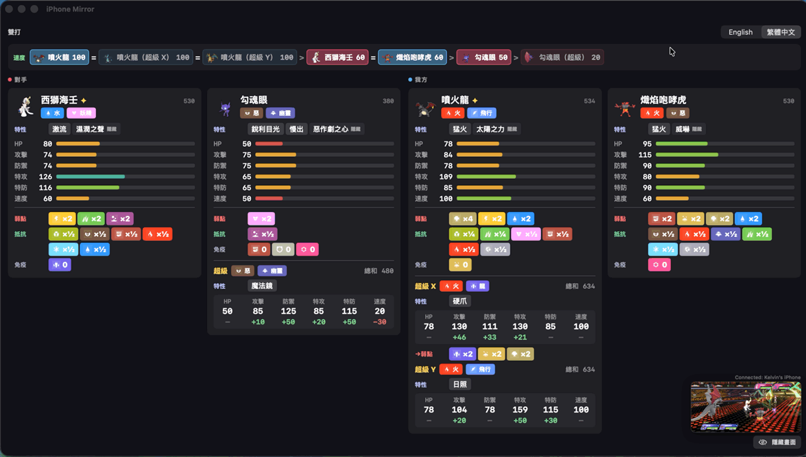

# Pokémon Champions Analyzer

A macOS app that mirrors your iPhone over USB while you play **Pokémon Champions**,
recognises every Pokémon on the field, and shows its stats, abilities, type matchups,
possible Mega Evolutions and speed order in real time.

It only looks at the screen. Nothing is installed on the iPhone and the game is
not modified.



## Features

- **Automatic identification** in singles and doubles, including shiny Pokémon,
  Mega forms and regional forms, with 786 reference sprites.
- **Stat cards** with typing, abilities (hover over one for its description, with
  the hidden ability marked), base stats and total.
- **Type matchups**: weaknesses (×4, ×2), resistances (×½, ×¼) and immunities.
- **Mega Evolution preview**: every Mega a Pokémon could turn into, including
  Champions-exclusive forms such as Mega Z, with each Mega's typing, ability and
  stat changes. When the typing changes, its new weaknesses are shown too.
- **Speed list**: every Pokémon seen this battle plus their possible Megas, fastest
  first, with ties marked and the Pokémon currently on the field highlighted.
- **Doubles layout** with four columns, one per slot, in the game's left-to-right
  order.
- **English and Traditional Chinese (繁體中文)**, switchable at any time.
- **Stable display**: cards stay up through move animations, and the panel clears
  when the first Pokémon of the next battle is identified.
- **Small floating mirror** in the corner, with a button to hide it.

## Requirements

- A Mac running macOS. Tested on macOS 26.6; the code uses macOS 13 APIs, but
  earlier versions haven't been tried.
- Xcode Command Line Tools, for `swiftc` (`xcode-select --install`).
- Python 3, standard library only.
- An iPhone with Pokémon Champions, a USB cable, and the iPhone set to trust
  this Mac.
- An internet connection for the one-time data download.

## Setup

```bash
git clone https://github.com/sheeenie/pokemon-champions-anyalzer.git
cd pokemon-champions-anyalzer
python3 tools/fetch_pokedex.py
./build.sh
open iPhoneMirror.app
```

`tools/fetch_pokedex.py` downloads the reference sprites and Pokédex data. The
first run takes several minutes; after that, results are cached in
`tools/.cache`. The Pokémon sprites aren't included in this repository, so the
app can't identify anything until this script has run.

**Always start the app with `open`.** macOS only grants screen-capture permission
to the app bundle. Running the binary directly from a terminal gives a black
mirror. On first launch, allow the camera permission prompt: macOS treats the
iPhone's screen as a camera.

## Usage

1. Connect the iPhone, unlock it, and open Pokémon Champions.
2. Start a battle. Cards appear as each Pokémon's name plate is recognised,
   usually within about a second.
3. Use the switch at the top right to change language, and hover over an
   ability to read its description.
4. **Hide screen** / **Show screen** in the bottom-right corner toggles the
   mirror. Identification keeps running while it is hidden.

## How it works

**Capture.** A USB-connected iPhone can appear to macOS as a video capture device.
The app enables that through CoreMediaIO and reads frames with AVFoundation. It
analyses about four frames a second, separately from the on-screen preview.

**Identification.** Every name plate in a battle has a small Pokémon sprite, always
drawn at the same size and position. The app crops that sprite and compares it
against Pokémon Champions' own menu sprites, counting only pixels the sprite covers
so the plate's coloured background doesn't affect the result. It checks a few
positions around the expected spot, and only accepts a result that is clearly
better than the closest *different* species. No text is read, so nicknames and
custom Battle Names don't matter.

The sprite source matters. HOME and official artwork draw Pokémon in a different
pose, and with those the correct species ranked anywhere from 1st to 4th of 30.
With Champions' own sprites it ranks 1st, well ahead of the next-closest species.
Shinies are separate reference sprites, since a shiny is a recolour.

**Stability.** A card only appears after three frames in a row agree. Name plates
disappear during every move animation, so a frame with no match never clears a
card. A black loading screen marks the end of a battle, and the next Pokémon
identified after it clears the panel for the new battle.

**Speed.** Built with `-O`, checking all four slots takes about 50 ms.

## Project layout

| Path | Purpose |
|---|---|
| `CaptureManager.swift` | iPhone detection and the capture session |
| `BattleAnalyzer.swift` | Frame analysis, black-screen detection, debug logging |
| `BattleGeometry.swift` | Calibrated name-plate and sprite positions |
| `IconMatcher.swift` | Sprite matching against the reference library |
| `BattleState.swift` | Card, speed list and reset state |
| `PokedexStore.swift` | Loads generated Pokédex data and sprites |
| `StatsPanel.swift` | The stats panel UI |
| `TypeChart.swift`, `TypeIcons.swift` | Type effectiveness, colours and icons |
| `Localization.swift` | English and Traditional Chinese text |
| `main.swift`, `CameraPreview.swift` | App entry point, window and mirror |
| `tools/fetch_pokedex.py` | Downloads sprites and generates `Resources/pokedex.json` |
| `build.sh` | Compiles the app and bundles `Resources/` |

## Troubleshooting

- **The mirror is black.** Unlock the iPhone and keep the game on screen. A
  sleeping iPhone sends only black frames.
- **"Waiting for iPhone…"** Check the cable, and that the iPhone trusts this Mac.
- **Nothing gets identified.** Run `python3 tools/fetch_pokedex.py`, then
  `./build.sh`. Also check the game is in a battle and in landscape.
- **Debug output.** Run
  `defaults write com.example.iPhoneMirror dumpDir -string ~/Desktop/pokemon-debug`,
  then relaunch. The app writes `analyzer.log` and sample annotated frames to that
  folder.

## Known limitations

- Screen positions were calibrated on an iPhone that captures at 2622×1206. Other
  iPhone models are untested.
- A few abilities, and some rare form names such as Vivillon patterns, have no
  Traditional Chinese text in PokéAPI and show in English.

## Credits

- Pokémon sprites: [Bulbagarden Archives](https://archives.bulbagarden.net/)
  ("Champions menu sprites" and "Champions Shiny menu sprites"). Downloaded locally
  by the setup script, not included in this repository.
- Type icons: Bulbagarden Archives (Scarlet and Violet icons).
- Stats, abilities and names: [PokéAPI](https://pokeapi.co/).
- Type colours: [52poke wiki](https://wiki.52poke.com/).

This is an unofficial fan project. It is not affiliated with or endorsed by
Nintendo, Creatures Inc., GAME FREAK inc. or The Pokémon Company. Pokémon and
Pokémon character names are trademarks of their respective owners.
