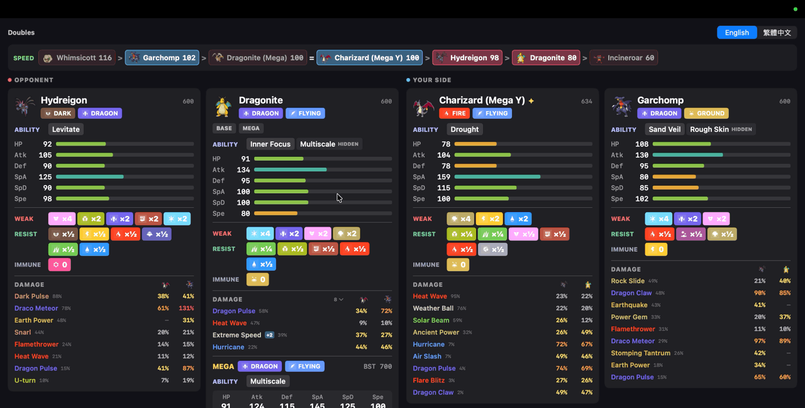
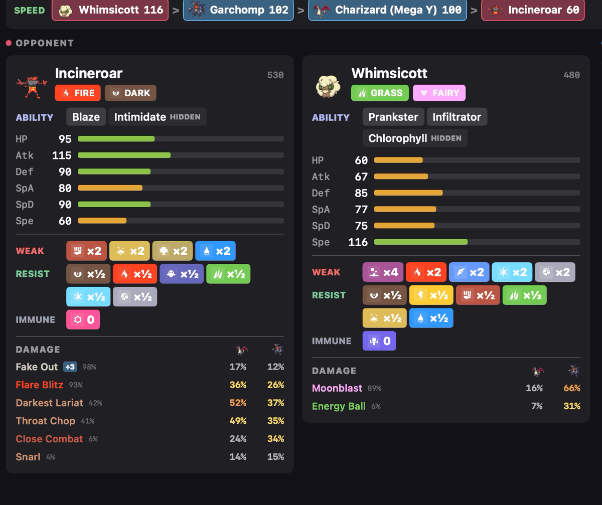

# Pokémon Champions Analyzer

A macOS app that mirrors your iPhone over USB while you play **Pokémon Champions**,
recognises every Pokémon on the field, and shows its stats, abilities, type matchups,
possible Mega Evolutions and speed order in real time.

It only looks at the screen. Nothing is installed on the iPhone and the game is
not modified.


## Features

### Automatic identification

Each Pokémon is recognised from its name plate as it comes onto the field, in
singles and doubles, including shiny Pokémon, Mega forms and regional forms
(786 reference sprites). When a Pokémon switches in, its card and the speed list
update.


### Stat cards and type matchups

Each card shows the Pokémon's typing, abilities (hidden ability marked), base
stats and total, plus its weaknesses (×4, ×2), resistances (×½, ×¼) and
immunities. Doubles uses four columns, one per slot, in the game's left-to-right
order.

### Ability descriptions

Hover over an ability to read what it does.


### Mega Evolution preview

A card lists every Mega the Pokémon could turn into, including
Champions-exclusive forms such as Mega Z, with each Mega's typing, ability and
stat changes. When the typing changes, the new weaknesses are shown too. Only
one Pokémon per side can Mega Evolve in a battle, so once one has, the rest of
that side's cards stop showing Mega previews.


Buttons under the name switch the card to any of those Megas: the card then
shows that form in full - sprite, typing, ability, stats, matchups and damage -
and the damage on both cards aims at the forms on show. **BASE** puts the
previews away without changing the form, which gives the damage list their
room. The card holds its choice until a different Pokémon is detected in that
slot.



### Speed list

Every Pokémon seen this battle, plus the Megas each could turn into, sorted
fastest first. Ties are joined with `=`, and the Pokémon currently on the field
are highlighted. Once a Pokémon has Mega Evolved, only that Mega is listed,
and the other Pokémon on its side no longer list possible Megas.


### Damage estimates



In a single battle, each card lists the moves that Pokémon is seen carrying,
most-used first, against the Pokémon across from it, as a share of its HP, with
how often each move is run. The list scrolls when it is long, and a card with no
Mega previews stacked below it - a Pokémon with no Mega, or a card already
switched to its Mega - grows taller and shows the whole list at once. Each move is tinted by its type, and one that moves
out of turn order is marked with its priority. They are listed in usage order
rather than by damage: how often a move is actually carried already prices in
what this calculator ignores - accuracy above all, but also PP, side effects
and how the move fits a real set. Move usage comes from
[championsbattledata.com](https://championsbattledata.com), separately for
singles and doubles: they are different games, and a Pokémon's sets barely
overlap - Garchomp runs Draco Meteor in singles and Dragon Claw with Rock Slide
in doubles. The panel reads the set for the battle being played. A snapshot
ships with the app, and each Pokémon is refreshed from their API the first time
it appears in a battle, so it keeps up with the meta. Without a connection the
snapshot is used.

Hover over a move for its details: its type, whether it is physical or special,
its power, accuracy and PP, and what it does besides damage - the recoil on
Flare Blitz, the flinch on Fake Out, the burn chance on a Fire move.

The numbers are deliberately a floor, not a prediction: they assume no Stat
Points, a neutral nature, no held item and no ability or weather effects, so a
real attacker hits at least this hard. Moves with no fixed base power, such as
Seismic Toss and Grass Knot, are left out rather than shown with a wrong
number.

In doubles each card shows a column per target, under that Pokémon's sprite:
both opponents. A move that would also catch your own partner - Earthquake and
the eleven like it - carries what it does to them in red, beside the move. The numbers
for a move that hits several Pokémon at once already include the 0.75× it takes
for doing so, which lifts again once only one target is left. A target that is
immune shows a dash rather than nothing, since a Flying Pokémon walking through
your Earthquake is the point of the row.

### English and Traditional Chinese

Switch the whole panel between English and 繁體中文 at any time.


### Built for use during play

- Cards stay up through move animations, and the panel clears when the first
  Pokémon of the next battle is identified.
- The mirror floats small in the corner, with a button to hide it.

## Requirements

- macOS 13 or later, on Apple Silicon or Intel. The app is built for both, but
  so far it has only been tested on macOS 26.6 with Apple Silicon.
- An iPhone with Pokémon Champions, a USB cable, and the iPhone set to trust
  this Mac; or an Android phone mirrored with [scrcpy](https://github.com/Genymobile/scrcpy)
  (see below).

## Download

1. Download `PokemonChampionsAnalyzer-<version>.zip` from the
   [latest release](https://github.com/sheeenie/pokemon-champions-anyalzer/releases/latest),
   then double-click it to unzip.
2. Move `Pokémon Champions Analyzer.app` to your Applications folder.
3. Open it. The first time, macOS blocks it because the app isn't signed with an
   Apple Developer ID. Click **Done**, not **Move to Trash**.
4. Open **System Settings → Privacy & Security**, scroll down to the message
   about Pokémon Champions Analyzer, click **Open Anyway**, then confirm. You
   only need to do this once.
5. When asked, allow camera access: macOS treats the iPhone's screen as a camera.

Nothing else needs installing: the sprites and Pokédex data are inside the app.

If macOS says the app "is damaged", or you'd rather skip steps 3 and 4, run this
in Terminal once, then open the app:

```bash
xattr -dr com.apple.quarantine "/Applications/Pokémon Champions Analyzer.app"
```

## Android

An iPhone offers its screen to macOS as a capture device, which is what this app
opens. Android offers nothing of the kind, so it goes through
[scrcpy](https://github.com/Genymobile/scrcpy), which mirrors the phone over adb
into an ordinary window; the app reads that window.

```bash
brew install scrcpy
brew install --cask android-platform-tools
scrcpy --window-borderless --no-audio --no-control
```

On the phone, turn on **Developer options → USB debugging**, plug it in, and
tap **Allow** when it asks about this computer. Use `--window-borderless`, or the
window's title bar becomes part of the picture and every region is off by its
height.

The first time, the app needs macOS's **Screen Recording** permission to read
another app's window: press **Use Android (scrcpy)** in the corner of the mirror,
allow it, and reopen the app. An iPhone is preferred whenever one is attached, so
the Android source only runs when it is not.

Google Cast is not an option: a Mac cannot act as a Cast receiver.

Screen positions are measured per device, so a phone needs a profile in
`CaptureProfile.swift`. Two ship: iPhone 17 and Pixel 7.

## Build from source

Needs Xcode Command Line Tools (`xcode-select --install`) and Python 3.

```bash
git clone https://github.com/sheeenie/pokemon-champions-anyalzer.git
cd pokemon-champions-anyalzer
python3 tools/fetch_pokedex.py
python3 tools/fetch_usage.py
./build.sh
open "Pokémon Champions Analyzer.app"
```

`tools/fetch_pokedex.py` downloads the reference sprites and Pokédex data. The
first run takes several minutes; after that, results are cached in
`tools/.cache`. The Pokémon sprites aren't included in this repository, so run
this script before building, or the app can't identify anything.

`tools/fetch_usage.py` builds the move-usage snapshot: which moves each Pokémon
carries, from championsbattledata.com, and each move's base power and type from
PokéAPI. It is only needed when cutting a release, since the app refreshes
itself from the same API while you play. Without it the app still runs; cards
simply show no damage estimates.

`build.sh` packs the sprites, type icons and Pokédex data into the app's
executable and builds for both Apple Silicon and Intel, so the built
`Pokémon Champions Analyzer.app` is self-contained and can be copied to another Mac.
`tools/make_release.sh <version>` does the same and zips it in `dist/` for a
GitHub Release.

**Always start the app with `open`.** macOS only grants screen-capture permission
to the app bundle. Running the binary directly from a terminal gives a black
mirror. On first launch, allow the camera permission prompt: macOS treats the
iPhone's screen as a camera.

## Usage

1. Connect the iPhone, unlock it, and open Pokémon Champions.
2. Start a battle. Cards appear as each Pokémon's name plate is recognised,
   usually within about a second.
3. Use the switch at the top right to change language, and hover over an
   ability to read its description.
4. **Hide screen** / **Show screen** in the bottom-right corner toggles the
   mirror. Identification keeps running while it is hidden.

## How it works

**Capture.** A USB-connected iPhone can appear to macOS as a video capture device.
The app enables that through CoreMediaIO and reads frames with AVFoundation. It
analyses about four frames a second, separately from the on-screen preview.

**Identification.** Every name plate in a battle has a small Pokémon sprite, always
drawn at the same size and position. The app crops that sprite and compares it
against Pokémon Champions' own menu sprites, counting only pixels the sprite covers
so the plate's coloured background doesn't affect the result. It checks a few
positions around the expected spot, and only accepts a result that is clearly
better than the closest *different* species. No text is read, so nicknames and
custom Battle Names don't matter.

The sprite source matters. HOME and official artwork draw Pokémon in a different
pose, and with those the correct species ranked anywhere from 1st to 4th of 30.
With Champions' own sprites it ranks 1st, well ahead of the next-closest species.
Shinies are separate reference sprites, since a shiny is a recolour.

**Stability.** A card only appears after three frames in a row agree. Name plates
disappear during every move animation, so a frame with no match never clears a
card. The end of a battle is the loading screen, recognised by the Rotom icon in
its bottom-right corner rather than by darkness alone: the screen also goes black
during move animations and camera cuts, and treating those as the end of a battle
cleared the panel mid-battle. The next Pokémon identified after a loading screen
clears the panel for the new battle.

**Damage.** Champions fixes every battle at level 50 with perfect IVs, so the
only unknowns are Stat Points, nature and held item. None are modelled: stats
come from base stats alone, and damage from the standard formula with STAB, type
effectiveness and the 85–100% roll. Moves are shown in the order they are
actually carried, which stands in for the accuracy and side effects the formula
leaves out. That makes every number a lower bound on
what an invested attacker does, which is a more useful error than a confident
guess at someone's spread would be.

**Speed.** Built with `-O`, checking all four slots takes about 50 ms.

## Project layout

| Path | Purpose |
|---|---|
| `CaptureManager.swift` | iPhone detection and the capture session |
| `BattleAnalyzer.swift` | Frame analysis, black-screen detection, debug logging |
| `BattleGeometry.swift` | What a battle slot is |
| `CaptureProfile.swift` | Where the regions sit, per device |
| `AndroidCapture.swift` | Reads a scrcpy window with ScreenCaptureKit |
| `IconMatcher.swift` | Sprite matching against the reference library |
| `BattleState.swift` | Card, speed list and reset state |
| `PokedexStore.swift` | Loads generated Pokédex data and sprites |
| `EmbeddedResources.swift` | Reads the sprites, type icons and Pokédex data packed into the executable |
| `StatsPanel.swift` | The stats panel UI |
| `TypeChart.swift`, `TypeIcons.swift` | Type effectiveness, colours and icons |
| `DamageCalc.swift` | Level-50 stats and damage estimates |
| `UsageStore.swift` | Move usage: the bundled snapshot and its live refresh |
| `Localization.swift` | English and Traditional Chinese text |
| `main.swift`, `CameraPreview.swift` | App entry point, window and mirror |
| `tools/fetch_pokedex.py` | Downloads sprites and generates `Resources/pokedex.json` |
| `tools/fetch_usage.py` | Generates `Resources/usage.json` and `moves.json` |
| `tools/pack_resources.py` | Packs `Resources/` into one file for `build.sh` to link into the executable |
| `tools/make_icon.swift` | Draws the app icon into `Assets/` |
| `build.sh` | Compiles the app, with `Resources/` packed into the executable |

## Troubleshooting

- **The mirror is black.** Unlock the iPhone and keep the game on screen. A
  sleeping iPhone sends only black frames.
- **Nothing at all, and the label reads "No camera access".** Allow it in
  System Settings → Privacy & Security → Camera. macOS ties that permission to
  the app's signature, so rebuilding the app from source asks again; a release
  build keeps its answer.
- **"Waiting for iPhone…"** Check the cable, and that the iPhone trusts this Mac.
- **Nothing gets identified.** Run `python3 tools/fetch_pokedex.py`, then
  `./build.sh`. Also check the game is in a battle and in landscape.
- **Debug output.** Run
  `defaults write io.github.sheeenie.pokemon-champions-analyzer dumpDir -string ~/Desktop/pokemon-debug`,
  then relaunch. The app writes `analyzer.log` and sample annotated frames to that
  folder.

## Known limitations

- Screen positions are calibrated per device: an iPhone capturing at 2622×1206,
  and a Pixel 7 mirrored at 2746×1236. Other models need their own profile, since
  the game anchors its name plates to the screen edges and a differently shaped
  screen puts them elsewhere.
- The Pixel 7 profile measures only the two singles slots; the doubles slots are
  inferred from the iPhone's spacing until a doubles battle is captured on it.
  Its loading-screen corner is the iPhone's, not yet confirmed.
- A few abilities, and some rare form names such as Vivillon patterns, have no
  Traditional Chinese text in PokéAPI and show in English.

## Credits

- Pokémon sprites: [Bulbagarden Archives](https://archives.bulbagarden.net/)
  ("Champions menu sprites" and "Champions Shiny menu sprites"). Downloaded locally
  by the setup script, not included in this repository.
- Type icons: Bulbagarden Archives (Scarlet and Violet icons).
- Stats, abilities, move data and names: [PokéAPI](https://pokeapi.co/).
- Move usage: [championsbattledata.com](https://championsbattledata.com).
- Type colours: [52poke wiki](https://wiki.52poke.com/).

This is an unofficial fan project. It is not affiliated with or endorsed by
Nintendo, Creatures Inc., GAME FREAK inc. or The Pokémon Company. Pokémon and
Pokémon character names are trademarks of their respective owners.
